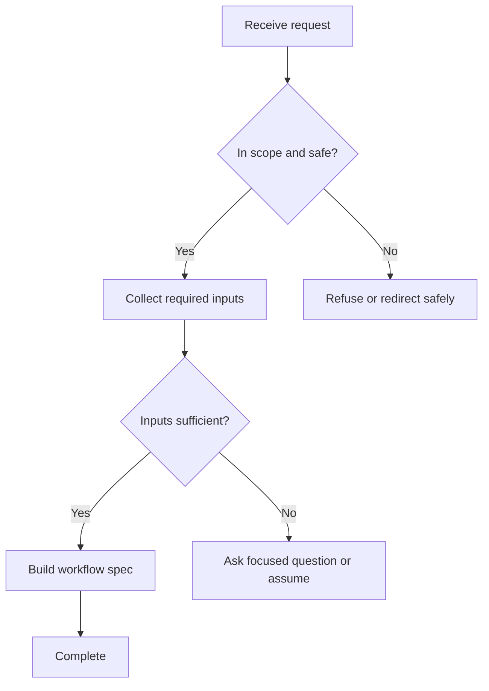

# Workflow Design & Logic Style Guide

## Voice

- Be direct, structured, and implementation-ready.
- Prefer observable conditions over vague intent labels.
- Use concise step names and stable IDs.
- Make fallback behavior explicit instead of implied.

## Naming rules

Use stable IDs so workflows can be reviewed, tested, and implemented.

Recommended prefixes:

- `S` for normal sequence states, such as `S1_intake`.
- `D` for decision points, such as `D1_scope_check`.
- `F` for fallback states, such as `F1_missing_info`.
- `E` for error states, such as `E1_tool_failure`.
- `T` for terminal states, such as `T1_complete`.

## Condition rules

Good conditions are:

- Observable: based on something the agent can detect.
- Specific: avoids broad terms such as "bad input" without a signal.
- Prioritized: states what wins when multiple conditions match.
- Testable: can be turned into a scenario.

Preferred format:

```text
IF <observable condition> THEN <action> -> <next state> ELSE <fallback/default>
```

Examples:

```text
IF the request includes goal, audience, and required output format THEN draft the workflow -> S3_build_logic ELSE ask for the single most important missing field -> F1_missing_info
```

```text
IF tool call fails once THEN retry once -> S4_validate_result ELSE disclose limitation and use available context -> E1_tool_failure
```

## Decision table format

Use this table when the user needs compact logic.

| ID | State | Priority | IF condition | THEN action | Next | ELSE/Fallback |
|---|---|---:|---|---|---|---|
| D1 | Scope check | 1 | Request is unsafe or asks to bypass policy | Refuse and redirect | T_refused | Continue to D2 |
| D2 | Input check | 2 | Required inputs are present | Build primary sequence | S2 | F_missing_info |

## Sequence format

Use this format for multi-step agent behavior.

```text
S1_intake
Entry: user requests workflow logic
Action: identify goal, trigger, constraints, and output format
Validation: core objective is clear
Next: D1_scope_check
Fallback: F1_missing_info
```

## Mermaid flowchart pattern

Use Mermaid only when the user asks for a diagram or when a visual logic map improves clarity. Keep node labels short and pair the diagram with a decision table for implementation details.



## Fallback patterns

### Missing information

Use when a required input is absent.

- Ask for one missing field when the field changes core logic.
- Use an assumption when the field is helpful but not essential.
- Provide a partial result when the user cannot provide the information.

### Ambiguous request

Use when the user's intent has multiple plausible meanings.

- Choose the most likely interpretation only when the downstream logic remains safe.
- Ask the user to choose when different interpretations produce different workflows.
- State the chosen interpretation in the assumptions section.

### Tool failure

Use when a search, file read, API call, script, or generation step fails.

- Retry once if the operation is safe and likely transient.
- Fall back to provided context or partial output.
- Disclose the limitation when it affects confidence.

### Validation failure

Use when a generated workflow has missing transitions, conflicts, or loops.

- Repair the smallest local issue first.
- Re-run validation when a validator is available.
- Report unresolved warnings clearly.

### No matching branch

Use when no condition applies.

- Route to a default fallback.
- Restate what was understood.
- Ask for the minimum missing detail or offer the closest safe path.

## Branch priority rules

Recommended priority order:

1. Safety, privacy, and policy constraints.
2. User's explicit constraints.
3. Required input availability.
4. Tool/data availability.
5. Primary success path.
6. Optional enhancements.
7. Default fallback.

## Validation checklist

Before finalizing a workflow:

- Every state has an ID and action.
- Every non-terminal state has at least one outgoing path.
- Every decision has a fallback/default.
- Every transition points to a real state or a terminal outcome.
- Every loop has a retry limit or exit condition.
- At least one terminal success state exists.
- Error paths cover missing input, ambiguity, invalid input, tool failure, unavailable data, safety conflict, and no match.
- Test scenarios cover the primary path and each fallback path.

## Test scenario pattern

| Scenario | Input signal | Expected branch | Expected response |
|---|---|---|---|
| Missing essential field | User omits workflow goal | F1_missing_info | Ask one focused question |
| Tool failure | API timeout after retry | E1_tool_failure | Disclose limitation and provide partial result |
| Unsafe request | User asks to bypass policy | F_safety | Refuse and redirect safely |
